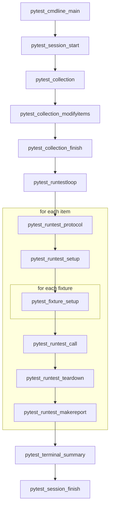
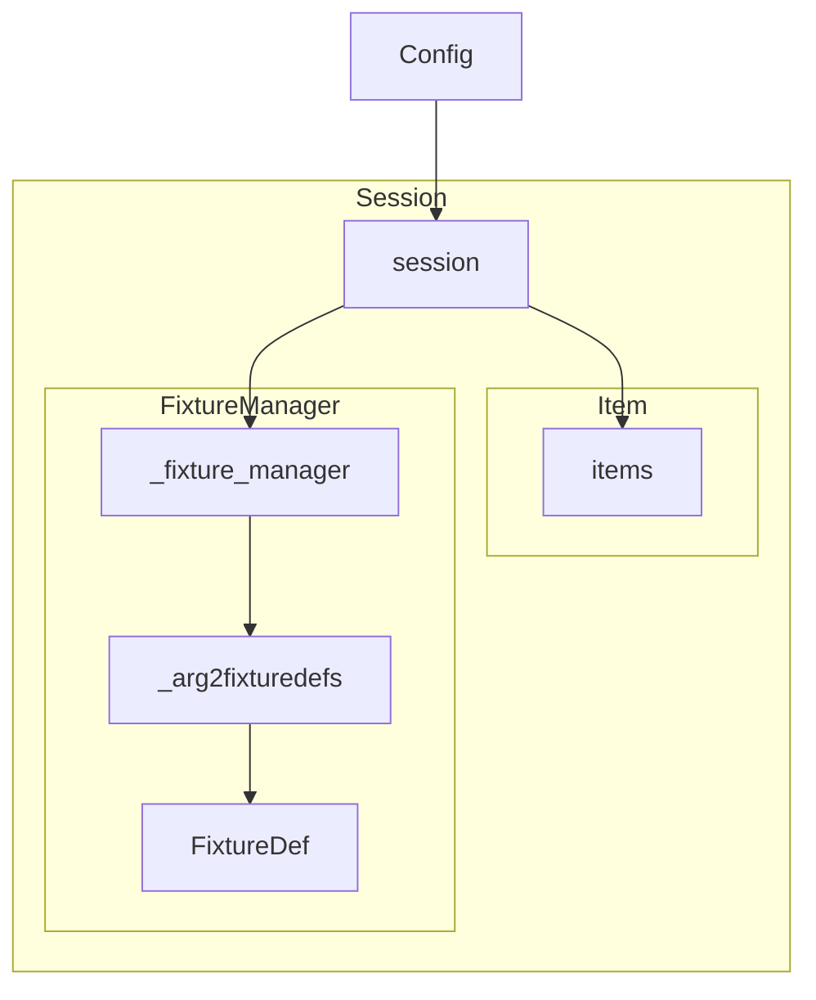
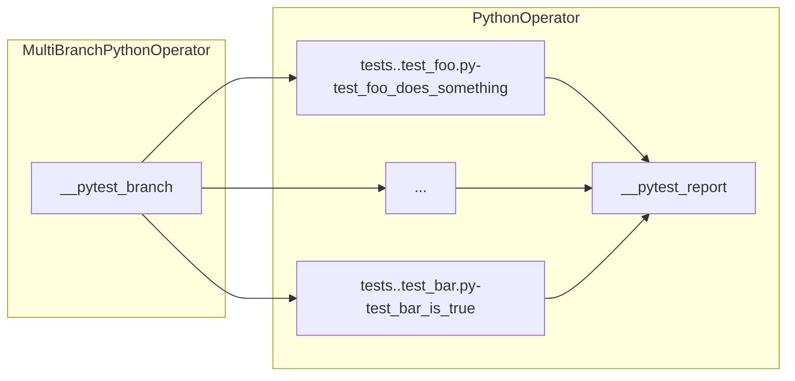

# pytest-airflow: Software architecture

`pytest-airflow` is a `pytest` plugin that allows tests to be run within
an Airflow DAG. This document describes the plugin's implementation which
takes advantage of `pytest` flexible and modular architecture.

This document is organised in two sections. The next section provides an
introduction to `pytest`. At its heart, `pytest` is a list of plugins
calls whose main objective is to collect fixtures and test item, execute
each test item and report the results. The intention of the
`pytest-airflow` plugin is to defer execution of tests to Airflow. The
subsequent section explains how this is implemented in the plugin.

For a shorter how-to-use guide please consult the README file.

## pytest: A Primer

### The program loop

`pytest` is meant to be used as a framework for testing code. It exposes
a single API that runs the main program loop, which can be thought as an
ordered list of instructions. A simplified version of the main feedback
loop is represented in figure 1 below. At the start of the loop, one finds
instructions for starting the session and collecting test items. As one
goes down this list, there are instructions for running the test,
reporting results and finally, at the end, for closing the session.


_Figure 1: `pytest` feedback loop_

Each item in the program loop above is actually a hook function defined by
`pytest` in `src/_pytest/hookspec.py`. This file specifies all hook
signatures available in `pytest` by decorating them with `@hookspec`.
During the execution of a hook function, `pytest` makes use of a library
called `pluggy` which will traverse the source code (and installed
plugins) registering and executing all hook implementations. Those
implementations are nothing more than functions defined with the same name
as its specification and sharing common argument names decorated or not
with `@hookimpl`.

As an example, the hook `pytest_collection_modifyitems` is called after
collection has been performed with the intention of filtering or
re-ordering the items in place. The hook specification defined in
`src/_pytest/hookspec.py` read as below:

```python
@hookspec
def pytest_collection_modifyitems(session, config, items):
```

In the source code, one finds the implementations of this specification in
multiple locations such as in `src/_pytest/main.py` and in
`src/_pytest/mark/__init__.py` which is replicated below. This
implementation will deselect test items from the list of collected items
based on keywords and marks passed by the user with the `-k` and `-m` flag
respectively. This is a possible because argument states defined in the
hook signature are maintained throughout the hook call. In this case, if
an item is removed from `items`, calls to subsequent registered functions
will see the filtered list.

```python
def pytest_collection_modifyitems(items, config):
    deselect_by_keyword(items, config)
    deselect_by_mark(items, config)
```

The order of hook implementation execution is random, however `pluggy`
allows one to pass parameters to `@hookspec` and `@hookimpl` to affect the
order in which hook implementations are executed. Setting the flag
`firstresult` in `@hookspec` allows the hook call to execute only until
the first of N registered functions returns a non-None result. Other
important flags are `tryfirst` and `trylast`, these flags are passed to
`@hookimpl` forcing the registered function to execute as early or as late
as possible respectively. Finally setting `hookwrapper=True` in
`@hookimpl`, wraps the execution of the hook call. In this case, a call to
`yield` in the hook implementation will pass the execution forward until
all registered functions complete returning to the wrapping function at
the end.

### Class hierarchy

In order to keep track of the state throughout the program loop, `pytest`
instantiates a number of different classes to support this process as
depicted in figure 2 below. It begins at `pytest_cmdline_main` by
instantiating the `Config` class for parsing and reading user
configuration. With the instantiated object, `pytest` creates a `Session`
class which is started when running `pytest_session_start`.


_Figure 2: Relationship between key classes_

During the collection process (`pytest_collection`), `pytest` traverses
the file system looking for test items and fixtures. Test items are
collected with the aid of classes that derive from the `Node` class. As
`pytest` traverses the file system, it collects files, within files it
collects modules, followed by classes and functions. In order to identify
test items, `pytest` looks for python files prefixed with `test_`, within
those files it looks for classes prefixed with `Test` and functions
prefixed with `test_`. At the end of the collection process, the
instantiated `Session` will have a reference to the traversed tree and to
the test items which are kept in a list called `items`. All of the test
items are instances of the `Items` class. Python test functions are
derived from this class and are called `Function`.

During session set-up `pytest` creates a reference to an instance of the
`FixtureManager` class which handles fixture cache and resolution.
Fixtures are nothing more than resources available to the test function
which can request fixtures by listing them in the argument list in their
signature. When processing test items, `pytest` will read through the
argument list and will enquire the `FixtureManager` whether there are any
fixtures available with the given names. Fixtures are identified by
functions defined with the `@pytest.fixture` in any file seen by `pytest`.
They are functions or generators which can return values or initiate
processes before tests are executed. Fixtures might have finalizers that
are ran after the test to clean any hanging resource up.

Once test collection is over, `pytest` loops through the list of
collected items, sets each test up by running all fixture calls, then
execute the tests and finally finalizes all fixtures and tests.

## pytest-airflow: An implementation overview

The main objective of the `pytest-airflow` plugin is to defer execution of
the tests (and some of its fixtures) to an Airflow task such that the
tests can be run by the airflow scheduler independent of each other. In
order to achieve this objective, the plugin takes advantage of the plugin
API made available in `pytest` as explained in the previous section and
injects code during key steps of the program loop to construct an Airflow
DAG.

### The pytest DAG

The DAG constructed by the plugin is of the form depicted in figure
3 below. The DAG begins with the `__pytest_branch` task which is an
instance of the custom defined `MultiBranchPythonOperator`. Airflow
requires that any DAG be completely defined before it is run. So by the
nature of Airflow, it is not possible to use ``pytest`` to collect tests
at runtime according to some user criteria only known at runtime. Rather,
when using the `pytest-airflow` plugin ``pytest`` is used to generate the
set of all possible desired tests according to some user criteria before
runtime. The usefulness of the `__pytest_branch` task is to then mark
downstream tests to skip according to user criteria passed to the DAG at
runtime using the configuration parameter (`-c/--conf`) of the
`trigger_dag` command. As an example in the DAG illustrated in figure
3 below, if the user were to trigger the generated `pytest` DAG with
`trigger_dag -c '{"keyword": ["foo"]}'` then `__pytest_branch` would mark
all tasks that do not have the keyword `foo` to skip which in this case
include the task `tests..test_bar.py-test_bar_is_true`.


_Figure 3: pytest-airflow DAG_

Connected downstream to `__pytest_branch` are all the test items. Those
items are encapsulated in a `PythonOperator` whose callable execute
deferred fixtures and the tests themselves, pushing the results to the
`xcom` channel.

Finally, the last task in the DAG is `__pytest_report` which is an
instance of a `PythonOperator`. The objective of this task is to report
the test results. Its callable is a `pytest` fixture which by default is
defined in the plugin but can also be defined by the user and will usually
collect the test results from the `xcom` channel of its upstream tasks for
reporting.

### Cmdline Modifications

The plugin implements two hooks that affect the behaviour of the `pytest`
cmdline interface. First it adds two new options to `pytest` using the
`pytest_addoption` hook. The first option is `--airflow` which determines
whether the plugin should be activated or not. By default, `pytest` will
make use of all the installed plugins. `pytest-airflow` defensively
disable itself if not explicitly required with the `--airflow` flag. The
second option is `--dag-id` which the user can use to define the DAG id.
If not explicitly defined, the DAG is named `pytest` by default.

The second hook implemented in this section is `pytest_cmdline_main`.
`pytest-airflow` wraps the execution of the call to `pytest_cmdline_main`
with the intention of adding a pointer to the DAG generated by the plugin
to `config._dag` and forcing the program loop to return this DAG.

### Fixtures

The plugin requires 4 fixtures to operate whose defaults are defined in
the plugin but which can be defined by the users themselves:

- `task_ctx`: returns a dictionary that is updated with the task context
    when the test is executed in Airflow. The default is to return an
    empty dictionary, however a user could modify this fixture to include
    additional keys to the dictionary.

- `dag_default_args`: returns a dictionary of `default_args` required for
    instantiating a DAG.

- `dag`: returns an instance of a `DAG` object. The default is to return
    an instance of the `DAG` whose id is equal to `pytest` or to the value
    of `dag_id` if the user passed one. This fixture depends on another
    fixture, `dag_default_args` which defines the default arguments for
    the instantiated DAG.

- `dag_report`: the callable for the report task. Its argument should be
    `**kwargs`, which is a reference to the DAG context as defined in the
    Airflow documentation. The default implementation simply logs the
    result of all the upstream test items as obtained from the `xcom`
    channel.


