# pytest-airflow: Software Architecture

`pytest-airflow` is a plugin for `pytest` that allows tests to be run 
within an Airflow DAG. This document describes the plugin's implementation 
which takes advantage of `pytest` flexible and modular architecture.

For a shorter how-to-use guide please consult the README file.

## pytest: A Primer

`pytest` is meant to be used as a framework for testing code. It exposes
a single API that runs the main program loop, which can be thought as an
ordered list of instructions. A simplified version of the main feedback
loop is represented in figure 1 below. At the start of the loop, one finds
instructions for starting the session and collecting test items. As one
goes down this list, there are instructions for running the test,
reporting results and finally closing the session.

```mermaid
graph LR

      0[pytest_cmdline_main]
0 --> 1[session_start]
1 --> 2[pytest_collection]
2 --> 3[pytest_collection_modifyitems]
3 --> 4[pytest_collection_finish]
4 --> 5[pytest_runtestloop]
5 --> 5a[pytest_runtest_protocol]

    subgraph for each item
        5a --> 5b[pytest_runtest_setup]
        5b --> 5bi

        subgraph for each fixture
            5bi[pytest_fixture_setup]
        end

        5bi --> 5c[pytest_runtest_call]
        5c --> 5d[pytest_runtest_teardown]
        5d --> 5e[pytest_runtest_makereport] 
    end

5e --> 6[pytest_terminal_summary]
6 --> 7[pytest_session_finish]
```

Figure 1: `pytest` feedback loop

Each instruction item is actually a hook function defined by `pytest` in
`src/_pytest/hookspec.py`. This file specifies all hook signatures
available in `pytest` by decorating them with `@hookspec`. During the
execution of a hook function, `pytest` makes use of a library called
`pluggy` which will traverse the `pytest` source code (and installed
plugins) registering and executing all hook implementations. Those
implementations are nothing more than functions defined with the exact
same signature as its specification but decorated with `@hookimpl`. 

The order of hook implementation execution is random, however `pluggy`
allows one to pass parameters to `@hookspec` and `@hookimpl` to affect the
order in which hook implementations are executed. Setting the flag
`firstresult` in `@hookspec` allows the hook call to execute only until
the first of N registered functions returns a non-None result. Other
important flags are `tryfirst` and `trylast`, these flags are passed to
`@hookimpl` forcing the registered function to execute as early or as late
as possible respectively. Finally setting `hookwrapper=True` in
`@hookimpl`, wraps the execution of the hook call. In this case, a call to
`yield` in the hook implementation will pass the execution forward until
all registered functions complete returning to the wrapping function at
the end.

The state of the arguments defined in the hook signature is maintained
throughout the complete hook call. That means that a hook that specifies
a list of items as one of its arguments could see the list being modified
throughout the execution of all its registered functions. A hook
implementation could remove an item from the list. In which case, the
following registered function will see the modified list with one less
item. Hooks such as `pytest_collection_modifyitems` make use of this
future by keeping a list of collected test items as one of its arguments.
Some of its implementation calls will filter that list based on certain
criteria passing it along with a reduced size. At the end of the hook
execution, `pytest` has access to the final list of collected items for
testing.

