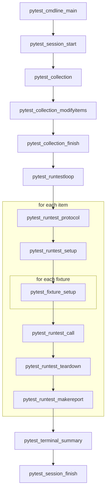
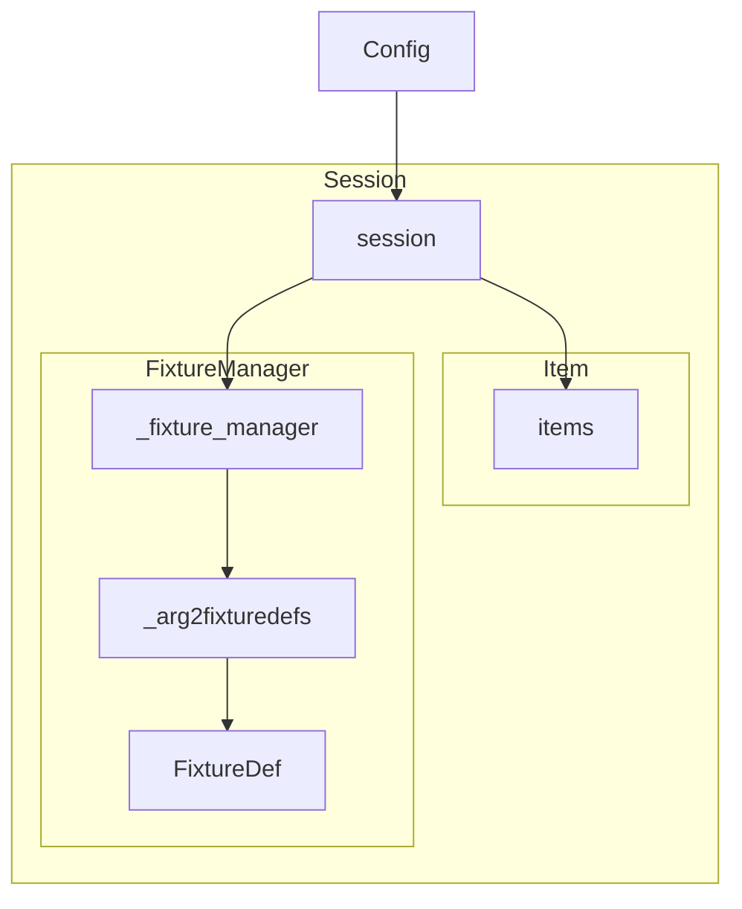
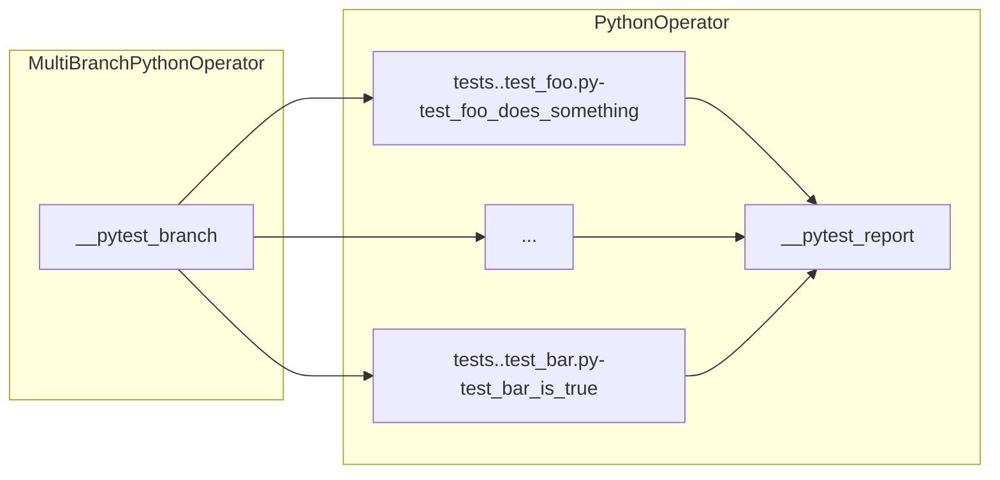

# pytest-airflow: Software architecture

`pytest-airflow` is a `pytest` plugin that allows tests to be run within
an Airflow DAG. This document describes the plugin's implementation which
takes advantage of `pytest` flexible and modular architecture.

This document is organised in two sections. The next section provides an
introduction to `pytest`. At its heart, `pytest` is a list of plugin calls
whose main objective is to collect fixtures and test item, execute each
test item and report the results. The intention of the `pytest-airflow`
plugin is to defer execution of tests to Airflow. The second section
explains how this is implemented in the plugin.

For a shorter how-to-use guide please consult the README file.

## pytest: A Primer

### The program loop

`pytest` is meant to be used as a framework for testing code. It exposes
a single API that runs the main program loop, which can be thought as an
ordered list of instructions. A simplified version of the main feedback
loop is represented in figure 1 below. At the start of the loop, one finds
instructions for starting the session and collecting test items. As one
goes down this list, there are instructions for running the test,
reporting results and finally, at the end, for closing the session.


_Figure 1: `pytest` feedback loop_

Each item in the program loop above is actually a hook function defined by
`pytest` in `src/_pytest/hookspec.py`. This file specifies all hook
signatures available in `pytest` by decorating them with `@hookspec`.
During the execution of a hook function, `pytest` makes use of a library
called `pluggy` which will traverse the source code (and installed
plugins) registering and executing all hook implementations. Those
implementations are nothing more than functions defined with the same name
as its specification and sharing common argument names decorated or not
with `@hookimpl`.

As an example, the hook `pytest_collection_modifyitems` is called after
collection has been performed with the intention of filtering or
re-ordering the test items in place. The hook specification defined in
`src/_pytest/hookspec.py` read as below:

```python
@hookspec
def pytest_collection_modifyitems(session, config, items):
```

In the source code, one finds the implementations of this specification in
multiple locations such as in `src/_pytest/main.py` and in
`src/_pytest/mark/__init__.py` which is replicated below. This
implementation will deselect test items from the list of collected items
based on keywords and marks passed by the user with the `-k` and `-m` flag
respectively. This is possible because the state of the argument defined
in the hook signature are maintained throughout the hook call. In this
case, if an item is removed from `items`, calls to subsequent registered
functions will see the filtered list.

```python
def pytest_collection_modifyitems(items, config):
    deselect_by_keyword(items, config)
    deselect_by_mark(items, config)
```

The order of hook implementation execution is random, however `pluggy`
allows one to pass parameters to `@hookspec` and `@hookimpl` to affect the
order in which hook implementations are executed. Setting the flag
`firstresult` in `@hookspec` allows the hook call to execute only until
the first of N registered functions returns a non-None result. Other
important flags are `tryfirst` and `trylast`, these flags are passed to
`@hookimpl` forcing the registered function to execute as early or as late
as possible respectively. Finally setting `hookwrapper=True` in
`@hookimpl`, wraps the execution of the hook call. In this case, a call to
`yield` in the hook implementation will pass the execution forward until
all registered functions complete returning to the wrapping function at
the end.

### Class hierarchy

In order to keep track of the state throughout the program loop, `pytest`
instantiates a number of different classes to support this process as
depicted in figure 2 below. `pytest_cmdline_main` begins by instantiating
the `Config` class which parses user configuration. With the instantiated
object, `pytest` creates a `Session` class which is started when
`pytest_session_start` is invoked.


_Figure 2: Relationship between key classes_

During the collection process (`pytest_collection`), `pytest` traverses
the file system looking for test items and fixtures. Test items are
collected with the aid of classes that derive from the `Node` class. As
`pytest` traverses the file system, it collects files, within files it
collects modules, followed by classes and functions. In order to identify
test items, `pytest` looks for python files prefixed with `test_`, within
those files it looks for classes prefixed with `Test` and functions
prefixed with `test_`. At the end of the collection process, the
instantiated `Session` will have a reference to the traversed tree and to
the test items which are kept in a list called `items`. All of the test
items are instances of the `Items` class. Python test functions are
derived from this class and are called `Function`.

During session set-up `pytest` creates a reference to an instance of the
`FixtureManager` class which handles fixture cache and resolution.
Fixtures are nothing more than resources available to the test function
which can request fixtures by listing them in the argument list in their
signature. When processing test items, `pytest` will read through the
argument list and will enquire the `FixtureManager` whether there are any
fixtures available with the given names. Fixtures are identified by
functions defined with the `@pytest.fixture` decorator in any file seen by
`pytest`. They are functions or generators which can return values or
initiate processes before tests are executed. Fixtures might have
finalizers that are ran after the test to clean any hanging resources up.

Once test collection is over, `pytest` loops through the list of collected
items. For each item, it sets the test up by running all fixture calls,
then execute the tests and finally finalizes the test together with all
its fixtures.

## pytest-airflow: An implementation overview

The main objective of `pytest-airflow` is to defer execution of the tests
(and some of its fixtures) to Airflow tasks in order to have them executed
independently by the Airflow scheduler. To achieve this objective,
`pytest-airflow` takes advantage of the plugin hooks made available in
`pytest`, injecting code during key steps of the program loop to construct
an Airflow DAG.

### The pytest DAG

The DAG constructed by the plugin is of the form depicted in figure
3 below. The DAG begins with the `__pytest_branch` task which is an
instance of the `MultiBranchPythonOperator`. Airflow requires that any DAG
be completely defined before it is run. So by the nature of Airflow, it
would not possible to use `pytest` to collect tests at runtime according
to some user-defined criteria only known at runtime. Rather, `pytest` is
used to generate the set of all desired tests. `__pytest_branch` is
invoked at runtime to mark which downstream tests are meant to be skipped
according to user criteria, which is passed to the `trigger_dag` command
with `-c/--conf`. For instance, if the user were to trigger the `pytest`
DAG of figure 3 below with `trigger_dag -c '{"keyword": ["foo"]}'` then
`__pytest_branch` would mark all tasks that do not have the keyword `foo`
to skip which in this case include the task
`tests..test_bar.py-test_bar_is_true`.


_Figure 3: pytest-airflow DAG_

Directly, connected downstream to `__pytest_branch` are all the test
items. Those items are encapsulated in a `PythonOperator` whose callable
execute deferred fixtures and the tests themselves, pushing the results to
the `xcom` channel.

Finally, the last task in the DAG is `__pytest_report` which is an
instance of a `PythonOperator`. The objective of this task is to report
test results. Its callable is a `pytest` fixture which by default is
defined in the plugin but can also be defined by the user and will usually
collect test results from the `xcom` channel for reporting.

### Cmdline Modifications

The plugin implements two hooks that affect the behaviour of `pytest`
cmdline interface. First it adds two new options to `pytest` using the
`pytest_addoption` hook. The first option is `--airflow` which determines
whether the plugin should be activated or not. By default, `pytest` will
make use of all the installed plugins. `pytest-airflow` defensively
disables itself if not explicitly requested with the `--airflow` flag. The
second option is `--dag-id` which the user can use to define a custom DAG
id. If not explicitly defined, the DAG is named `pytest` by default.

The second hook implemented in this section is `pytest_cmdline_main`.
`pytest-airflow` wraps the execution of the call to `pytest_cmdline_main`
with the intention of adding a pointer to the DAG generated by the plugin
to `config._dag` and forcing the program loop to return this pointer.

### Fixtures

The plugin requires 4 fixtures to operate whose defaults are defined in
the plugin but which can be defined by the users themselves:

- `task_ctx`: returns a dictionary that is updated with the task context
    when the test is executed in Airflow. The default is to return an
    empty dictionary, however a user could modify this fixture to include
    additional keys to the dictionary.

- `dag_default_args`: returns a dictionary of `default_args` required for
    instantiating the DAG.

- `dag`: returns an instance of a `DAG` object. The default is to return
    an instance of the `DAG` whose id is equal to the value of `dag_id`
    passed by the user or `pytest` if the user passed none. This fixture
    depends `dag_default_args` fixtures which defines the default
    arguments for the instantiated DAG as explained above.

- `dag_report`: the callable for `__pytest_report`. Its argument should be
    `**kwargs`, which is a reference to the DAG context as defined in the
    Airflow documentation. The default implementation simply logs the
    result of all the upstream test items obtained from the `xcom`
    channel.

### DAG Initialization

`pytest-airflow` initializes the DAG during the execution of
`pytest_collection_modifyitems` by defining a hook wrapper for this hook.
Within this function, an instance of the DAG is retrieved with a call to 
`_init_dag` which expects an instance of the current testing session as an 
argument.

The first thing that `_init_dag` does is to retrieve the values of 
`dag_default_args` and `dag` from the fixtures described in the previous 
sub-section. In order to do so, we first make a call to `_get_fixture`.

`_get_fixture` expects as arguments the name of the desired fixture and
the current session. The function retrieves the fixture manager from the
session and loops through the dictionary of fixtures located in the
fixture manager to retrieve the list of possible fixtures with the
requested name. Fixtures with the same name can be defined in multiple
places. By default, `pytest` will use the fixture defined closest to the
target test item. Since our objective is to create a single DAG for the
entire collection of test items, we loop through the list of potential
fixture candidates to find the one which is closet to all the test items 
while covering them all. `_get_fixture` returns a `FixtureDef` that 
fulfills this criteria.

With pointers to the required `FixtureDef`, `_init_dag` proceeds with
computing the value of those fixtures by calling `_compute_fixture_value`.
In order to compute the value of a `FixtureDef`, `pytest` requires
a context. This context is provided by any test item in the collection of
items, thus we pick the first test item's context to compute the value of
the fixture. Test items store this context in a pointer called `_request`.
Once fixture values are calculated they are stored in the `FixtureDef`
itself in `cached_result`. We retrieve this value and store them in
`_request` in order to make them available to the computation of other
fixtures within that context. Finally, we return the computed value.

Back to `_init_dag`, the values of `dag_default_args` and `dag` are computed 
in the order which they are required. Finally, we clean up the session by 
finalizing any resources created during DAG initialization and we clean 
the dictionary of fixture definitions that was filled for the first 
item when computing the DAG. 

With the DAG object in hand, we update the `config._dag` pointer defined
in `pytest_cmdline_main`. Following that, we proceed with creating
`__pytest_branch` and `__pytest_report`. The `__pytest_branch` is defined
with a callable generated by `_pytest_branch_callable`. This function
takes the test items and returns a callable that will loop through the
collection of test items during runtime filtering that list according to
the user defined configuration parameters for `markers` and `keywords`.
This filtering is executed with calls to `_select_by_mark` and
`_select_by_keyword`. The callable then returns the list of tasks that
should be executed, marking the remaining ones to skip. Finally, the
callable to `__pytest_report` is obtained by calling `_get_fixture` with
the required fixture name (`dag_report`) and the current session. We then
retrieve the function call from the fixture definition located in `func`.

### Test runner

This is the core of `pytest-airflow` which is responsible for deferring
fixtures and test execution. Starting with `pytest_fixture_setup`, the
plugin determines whether a given `FixtureDef` object should be deferred
or not with a call to `_defer`. This function expects as argument
a fixture definition and a request, which is nothing more than an object
holding all the context for executing the test item.

`_defer` will recursively determine whether a fixture setup should be 
deferred based on whether its name starts with `defer_`, is equal to 
`task_ctx` or it depends on fixtures which fulfill these two first 
criteria.

In case a fixture should be deferred, our implementation of 
`pytest_fixture_setup` proceeds with collecting all the arguments that the 
fixture depends on and storing them in a dictionary. With that information 
in hand, it instantiates a `FixtureDeferredCall` object that holds the 
necessary information for performing the deferred execution. This class is 
initialized with the fixture definition, its kwargs and the request. The 
instantiated object is then cached with the fixture definition making it 
available to other fixtures that depend on it.

The initialization to `FixtureDeferredCall` stores the fixture function
whose execution will be deferred in `self.fixturefunc`. The kwargs is 
stored in `self.kwargs` and the function name in `self.argname`. The class 
makes use of internal variables to manage the deferred execution: 
`self._cached` determines whether the fixture has been computed, 
`self._res` stores the computed value, `self._req` stores the request and 
`self._finalizers` the fixture finalizers.

The deferred fixture is eventually executed when the Airflow task is
running. This is done with a call to `self.execute`. This method will
first check whether the fixture has already been cached. If not it
recursively updates its stored `kwargs` by requesting the calculation of
all `FixtureDeferredCalls` that it depends on. With the updated list of
`kwargs`, it then proceed by calling the fixture function in a controlled
environment that captures any exceptions. Finalizers are added to
`self._finalizers` after function execution and any errors are then
raised. In case, we are dealing with the special fixture `task_ctx`, the
program ensures that it returns a dictionary. Otherwise, it raises an 
error.

`FixtureDeferredCall` defines one last method called `finish` which is
responsible for finalizing any fixtures once the main test has been
executed. This is achieved by looping through the list of finalizers and
executing one after the other in a controlled environment that captures
all the exceptions, thus ensuring that all finalizers are eventually
attempted. If any exceptions are captured it raises the first
exception in the list at the end of the loop.

`pytest` executes test items with a call to `pytest_pyfunc_call` which
expects a test item as an argument. `pytest-airflow` implements a modified
version of this hook that instead of running the test instantiates
a `PythonOperator` task that gets connected to the DAG. The task callable
executes the deferred fixtures and the test whenever it is executed by the
the Airflow scheduler. Since `pytest_pyfunc_call` is called once for each
test item, `pytest-airflow` will produce an Airflow task for each test
item. The instantiated task is then connected upstream to
`__pytest_branch` and downstream to `__pytest_report`.

In order to generate the callable for the `PythonOperator` we invoke
`_task_callable`. This function expects as arguments the test item and its
test kwargs. We take care of removing from the kwargs the fixtures
required to instantiate the DAG for the plugin (ie. `dag`,
`dag_default_args` and `dag_report`) in case they are inadvertently
requested by the user.

The first step in the callable generated by `_task_callable` requests the
computation of all the deferred fixtures, updating the test arguments and
extending the internal list of finalizers.

Following that, it retrieves the test function from the test item and
calls the function with the updated test arguments in a controlled
environment. In case an exception is raised during execution, this
information is used to instantiate `ExceptionInfo` which is a `pytest`
class used to report test failures. Any finalizers registered during test
execution with the test session during test execution are appended to the
internal list of finalizers. The outcome and the exception information are
passed to the `xcom` channel making them available to `__pytest_report`.

To complete the callable, we call all the finalizers present in the
internal list of finalizers which include both the deferred fixture
finalizers and the test finalizers. These are called in a controlled
environment in order to ensure that all finalizers are attempted. If any
exception is raised they are pushed to an internal list of exceptions
which might already hold exceptions raised during the test. Before the
function returns, we raise the first exception in the list of exceptions
if such list is not empty.

### Terminal summary

`pytest-airflow` defines one last hook for `pytest_terminal_summary`. This 
function is merely responsible for printing information about the DAG 
generated by `pytest-airflow` to the terminal whenever the plugin is 
active. If the verbose level is 0, the plugin only prints the DAG id. If 
the verbose level is higher than 0, it prints the complete DAG tree.


